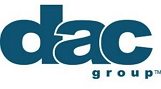
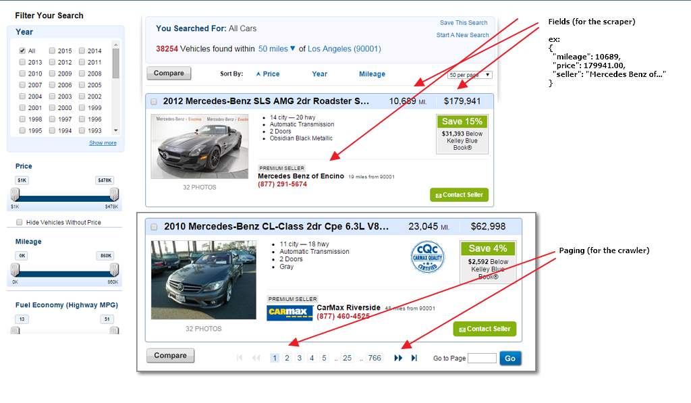

 

# HackerX Challenge

The goal of this challenge is to write a basic [web crawler](http://en.wikipedia.org/wiki/Web_crawler) and [web scraper](http://en.wikipedia.org/wiki/Web_scraping) that can save results to a flat (txt, csv, etc.) file.

The target web site doesn't really matter, but you should select a site that contains a search function, and has paged results.

You will have to crawl these pages and scrape the results; which you will then 

That's it.

For example, you could crawl a used car site and collect the summary details of each listing, then store those results as json to file.

## Requirements

There are no limitations on the language or technology stack. Just "Git Er Done!"

Do note that anything submitted is assumed to be [MIT](http://opensource.org/licenses/MIT) licensed.

## How to Participate

* Fork this repository
* Write your crawler/scraper
* Save your code to the `code/` directory
* Commit your code
* Submit a pull request

## License

Copyright (c) 2015, DAC Group

Permission is hereby granted, free of charge, to any person obtaining a copy
of this software and associated documentation files (the "Software"), to deal
in the Software without restriction, including without limitation the rights
to use, copy, modify, merge, publish, distribute, sublicense, and/or sell
copies of the Software, and to permit persons to whom the Software is
furnished to do so, subject to the following conditions:

The above copyright notice and this permission notice shall be included in
all copies or substantial portions of the Software.

THE SOFTWARE IS PROVIDED "AS IS", WITHOUT WARRANTY OF ANY KIND, EXPRESS OR
IMPLIED, INCLUDING BUT NOT LIMITED TO THE WARRANTIES OF MERCHANTABILITY,
FITNESS FOR A PARTICULAR PURPOSE AND NONINFRINGEMENT. IN NO EVENT SHALL THE
AUTHORS OR COPYRIGHT HOLDERS BE LIABLE FOR ANY CLAIM, DAMAGES OR OTHER
LIABILITY, WHETHER IN AN ACTION OF CONTRACT, TORT OR OTHERWISE, ARISING FROM,
OUT OF OR IN CONNECTION WITH THE SOFTWARE OR THE USE OR OTHER DEALINGS IN
THE SOFTWARE.
